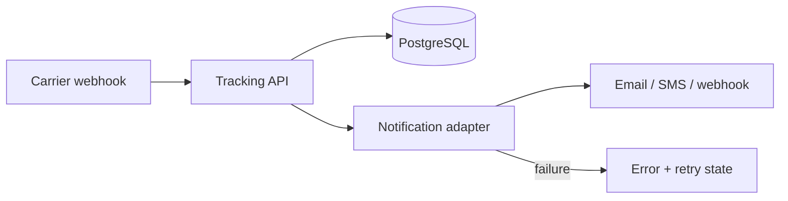

# ShipTrack API 📦

A production-minded REST API for shipment tracking and reliable customer notifications.

The project models a real logistics problem: carrier events arrive repeatedly and sometimes out of order, while customers expect every relevant update to be delivered and failures to remain visible.

## What it demonstrates

- Python and Flask API design
- PostgreSQL with SQLAlchemy 2.0
- Auditable shipment event history
- Idempotent carrier events
- Notification delivery states, errors and bounded retries
- Pagination and filtering
- Dockerized local environment
- Automated tests and Docker builds with GitHub Actions

## Architecture



The notification adapter is deterministic in local development: it validates recipients and records delivery attempts without contacting a real provider. Its boundary can be replaced by Amazon SES, SNS or an HTTP webhook client.

For a distributed AWS deployment, the same flow can evolve to API Gateway/ECS, SQS, a notification worker, RDS/Aurora and a dead-letter queue. The current database-backed retry model keeps that failure lifecycle explicit while remaining easy to run locally.

## Tech stack

- Python 3.11+
- Flask
- SQLAlchemy
- PostgreSQL (SQLite is used by isolated tests and as a zero-setup fallback)
- Docker and Docker Compose
- pytest
- GitHub Actions

## Run with Docker

```bash
git clone https://github.com/Morgana-Fstack/shiptrack-api.git
cd shiptrack-api
docker compose up --build
```

The API starts at `http://localhost:5000`. Docker Compose also starts PostgreSQL and waits for its health check before starting the API.

## Run without Docker

```bash
python -m venv .venv
source .venv/bin/activate       # Windows: .venv\Scripts\activate
pip install -r requirements.txt
python -m app.main
```

Without `DATABASE_URL`, the application uses a local SQLite database. To use PostgreSQL, copy `.env.example` and provide a SQLAlchemy connection URL.

## API reference

### Health check

```http
GET /health
```

### Create a shipment

```http
POST /shipments
Content-Type: application/json

{
  "order_id": "ORD-2026-001",
  "carrier": "DHL",
  "origin": "Florence, IT",
  "destination": "Curitiba, BR"
}
```

### List and filter shipments

```http
GET /shipments
GET /shipments?status=in_transit&page=1&per_page=20
```

`per_page` is capped at 100 to protect the service from unbounded list requests.

### Get a shipment and its tracking history

```http
GET /shipments/{shipment_id}
```

### Add a carrier event

```http
POST /shipments/{shipment_id}/events
Content-Type: application/json

{
  "external_event_id": "DHL-EVENT-98421",
  "status": "in_transit",
  "location": "São Paulo, BR",
  "description": "Package arrived at the sorting facility.",
  "channel": "email",
  "notify": "customer@example.com"
}
```

`external_event_id` makes repeated carrier deliveries idempotent. Sending it again returns the original event with `duplicate: true` instead of creating another event or notification.

Valid shipment states are `pending`, `picked_up`, `in_transit`, `out_for_delivery`, `delivered` and `failed`.

### Inspect notification delivery

```http
GET /shipments/{shipment_id}/notifications
```

Each record exposes `status`, `attempts`, `last_error`, `created_at` and `sent_at`, so a delivery failure never disappears silently.

### Retry a failed notification

```http
POST /notifications/{notification_id}/retry
```

Delivery is limited to three attempts. Further retries return `409 Conflict`, preventing an infinite retry loop.

## Tests and CI

```bash
pytest -v
```

The test suite covers shipment creation, validation, filtering, tracking history, idempotency, successful delivery, provider failure, visible error state and the maximum retry limit.

GitHub Actions runs the suite on Python 3.11 and 3.12 and verifies that the Docker image builds for every pull request.

## Design decisions

**Why preserve tracking events separately?** Updating only the latest shipment status would destroy history. An append-only event timeline makes disputes and operational debugging auditable.

**Why idempotency?** Carrier webhooks can be delivered more than once. A unique external event per shipment prevents duplicate state changes and duplicate customer messages.

**Why store notification failures?** A successful tracking update does not guarantee a successful customer message. Delivery status and errors are separate operational concerns.

**Why bounded retries?** Transient failures deserve another attempt, but an unlimited loop amplifies outages. After three attempts, the notification remains failed and available for investigation.

## Author

**Morgana Petterle da Cunha**  
Full Stack Developer  
[LinkedIn](https://linkedin.com/in/morgana-petterle) · [GitHub](https://github.com/Morgana-Fstack)
