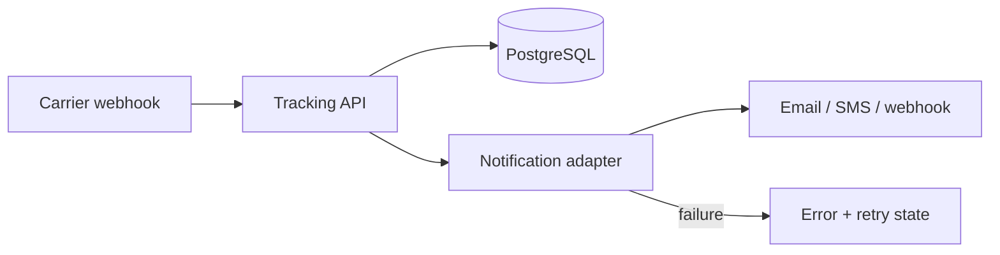
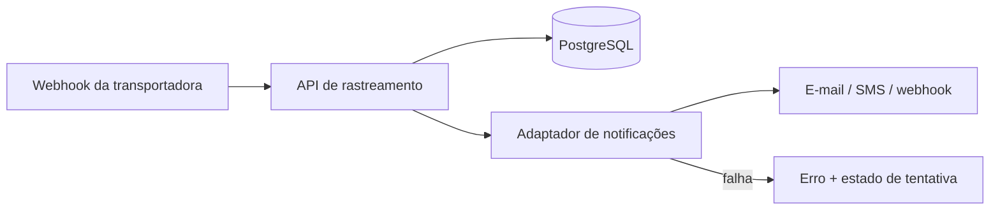

# ShipTrack API 📦

[English](#english) | [Português](#português)

## English

A production-minded REST API for shipment tracking and reliable customer notifications.

The project models a real logistics challenge: carrier events may arrive repeatedly or out of order, while customers expect relevant updates to be delivered and failures to remain visible.

### What it demonstrates

- Python and Flask API design;
- PostgreSQL with SQLAlchemy 2.0;
- auditable shipment event history;
- idempotent carrier events;
- notification states, error visibility and bounded retries;
- pagination and filtering;
- Dockerized local environment;
- automated tests and Docker builds with GitHub Actions.

### Architecture



The local notification adapter validates recipients and records attempts without contacting a real provider. It can be replaced by Amazon SES, SNS or an HTTP webhook client. On AWS, the flow can evolve to API Gateway or ECS, SQS, a notification worker, RDS/Aurora and a dead-letter queue.

### Tech stack

- Python 3.11+
- Flask and SQLAlchemy
- PostgreSQL; SQLite for isolated tests and zero-setup local use
- Docker and Docker Compose
- pytest and GitHub Actions

### Run with Docker

```bash
git clone https://github.com/Morgana-Fstack/shiptrack-api.git
cd shiptrack-api
docker compose up --build
```

The API starts at `http://localhost:5000`.

### Run without Docker

```bash
python -m venv .venv
source .venv/bin/activate       # Windows: .venv\Scripts\activate
pip install -r requirements.txt
python -m app.main
```

Without `DATABASE_URL`, the application uses a local SQLite database.

### Main endpoints

```http
GET  /health
POST /shipments
GET  /shipments?status=in_transit&page=1&per_page=20
GET  /shipments/{shipment_id}
POST /shipments/{shipment_id}/events
GET  /shipments/{shipment_id}/notifications
POST /notifications/{notification_id}/retry
```

Carrier updates may include an `external_event_id`. Repeated delivery of the same identifier returns the existing event instead of creating duplicate state changes or customer notifications. Notification attempts are limited to three and failures remain available for investigation.

### Tests

```bash
pytest -v
```

The suite covers creation, validation, filtering, tracking history, idempotency, successful delivery, provider failure and maximum retry limits.

---

## Português

API REST desenvolvida com uma abordagem próxima de produção para rastreamento de encomendas e notificações confiáveis aos clientes.

O projeto representa um desafio real de logística: eventos das transportadoras podem chegar repetidos ou fora de ordem, enquanto os clientes esperam receber atualizações relevantes e as falhas precisam permanecer visíveis.

### O que o projeto demonstra

- desenvolvimento de APIs com Python e Flask;
- PostgreSQL com SQLAlchemy 2.0;
- histórico auditável dos eventos de rastreamento;
- idempotência para eventos das transportadoras;
- status das notificações, visibilidade de erros e tentativas limitadas;
- paginação e filtros;
- ambiente local com Docker;
- testes automatizados e validação do Docker com GitHub Actions.

### Arquitetura



O adaptador local valida destinatários e registra tentativas sem acessar um provedor real. Ele pode ser substituído pelo Amazon SES, SNS ou por um cliente HTTP. Na AWS, o fluxo pode evoluir para API Gateway ou ECS, SQS, worker de notificações, RDS/Aurora e uma fila de mensagens com falha.

### Tecnologias

- Python 3.11+
- Flask e SQLAlchemy
- PostgreSQL; SQLite para testes isolados e execução local sem configuração
- Docker e Docker Compose
- pytest e GitHub Actions

### Executar com Docker

```bash
git clone https://github.com/Morgana-Fstack/shiptrack-api.git
cd shiptrack-api
docker compose up --build
```

A API será iniciada em `http://localhost:5000`.

### Executar sem Docker

```bash
python -m venv .venv
source .venv/bin/activate       # Windows: .venv\Scripts\activate
pip install -r requirements.txt
python -m app.main
```

Sem a variável `DATABASE_URL`, a aplicação utiliza um banco SQLite local.

### Endpoints principais

```http
GET  /health
POST /shipments
GET  /shipments?status=in_transit&page=1&per_page=20
GET  /shipments/{shipment_id}
POST /shipments/{shipment_id}/events
GET  /shipments/{shipment_id}/notifications
POST /notifications/{notification_id}/retry
```

As atualizações das transportadoras podem incluir um `external_event_id`. Caso o mesmo identificador seja recebido novamente, a API retorna o evento existente e evita mudanças ou notificações duplicadas. As notificações têm limite de três tentativas e as falhas permanecem disponíveis para investigação.

### Testes

```bash
pytest -v
```

A suíte cobre criação, validação, filtros, histórico, idempotência, entrega bem-sucedida, falha do provedor e limite máximo de tentativas.

## Author / Autora

**Morgana Petterle da Cunha**  
Full Stack Developer / Desenvolvedora Full Stack  
[LinkedIn](https://linkedin.com/in/morgana-petterle) · [GitHub](https://github.com/Morgana-Fstack)
